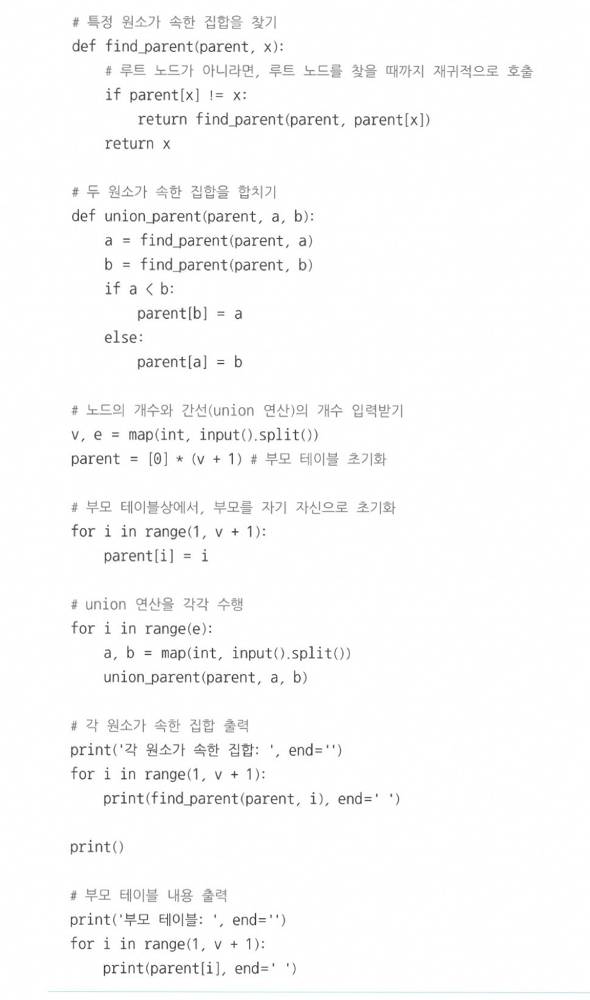
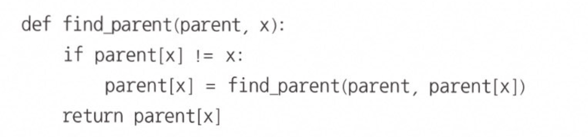
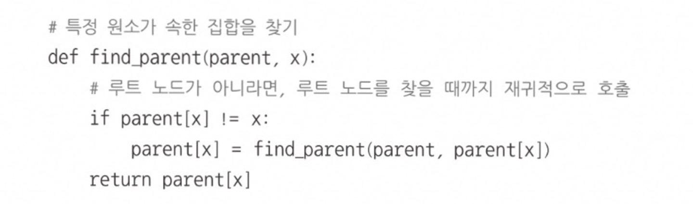
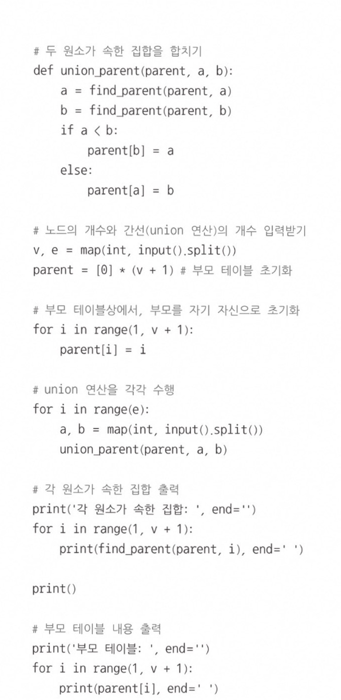
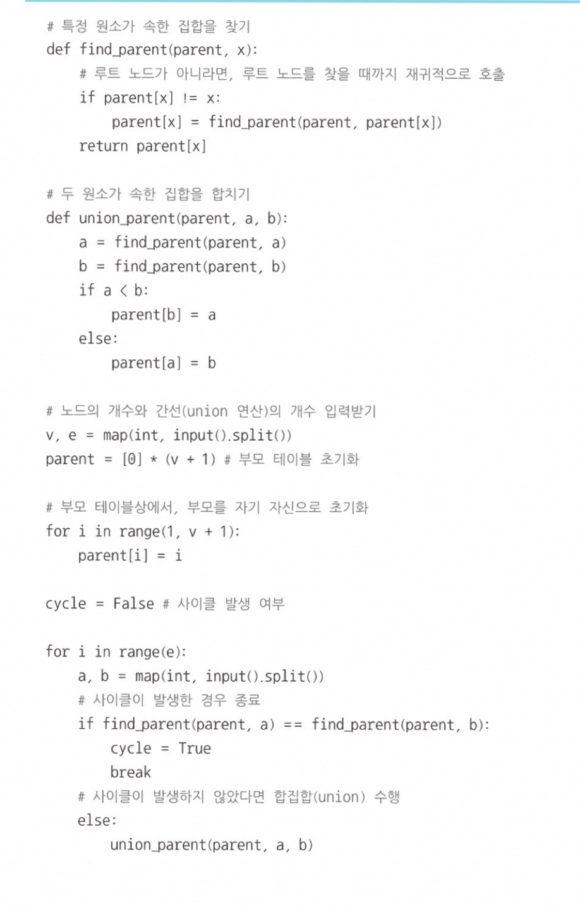
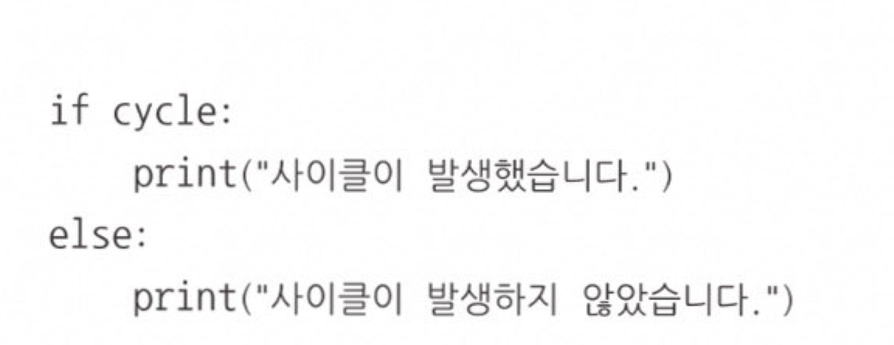
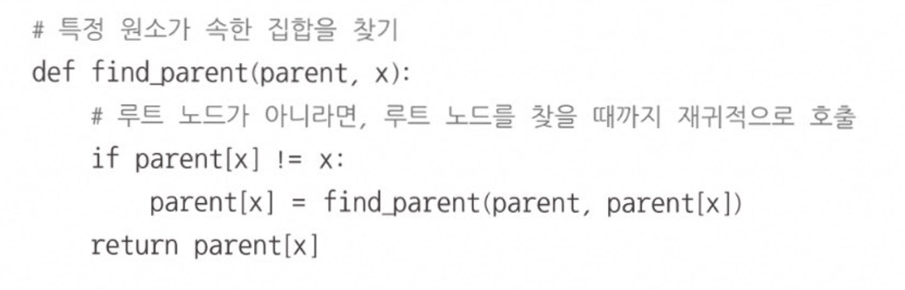
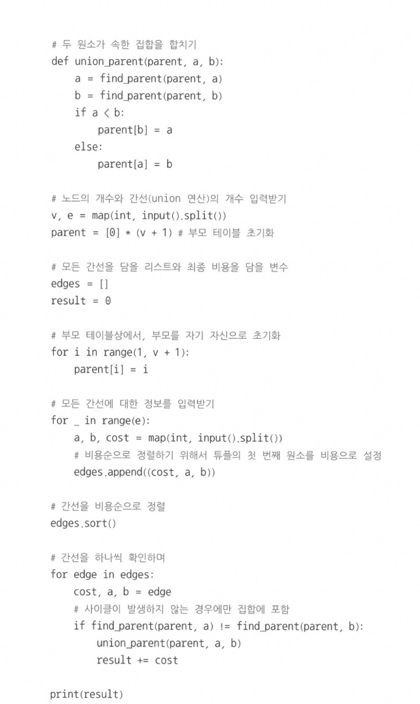
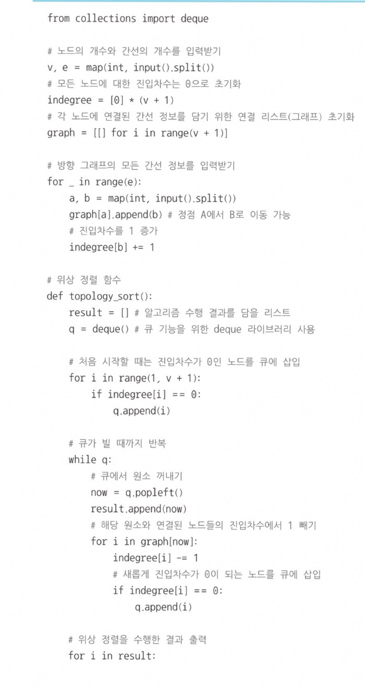
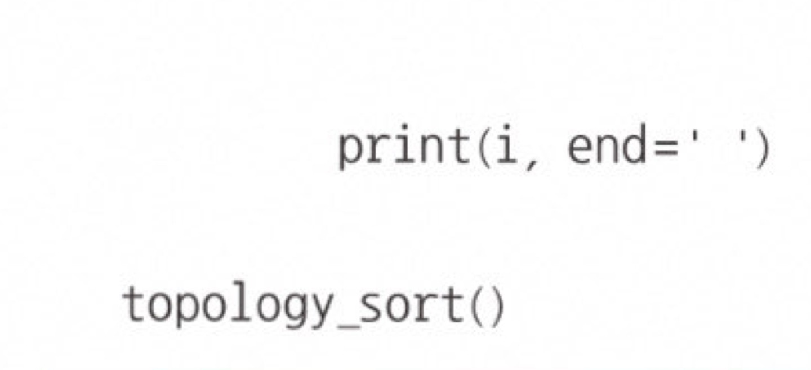

## 📍인접행렬 vs 인접리스트
인접행렬  : 2차원 배열을 사용하는 방식  
인접리스트 : 리스트를 사용하는 방식

  

# 서로소 집합
- Union 연산 사용
- Union 연산 사용시 작은 쪽으로 연결 즉 큰쪽 -> 작은쪽 작은 쪽이 부모 노드가 되는 것!
    

   

### find 함수를 이용한 경로 압축

   

### 📍개선된 코드

   

# 서로소 집합을 활용한 사이클 판별 ⭐
1. 각 간선을 확인하며 두 노드의 루트 노드를 확인 
1-1. 루트 노드가 서로 다르다면 두 노드에 대하여 union 연산 수행 
1-2. 루트 노드가 서로 같다면 사이클이 발생한 것
2. 그래프에 포함되어 있는 모든 간선에 대하여 1번 과정을 반복    

   

# 신장트리
하나의 그래프가 있을 때 모든 노드를 포함하면서 사이클이 존재하지 않는 부분 그래프    

# 크루스칼 알고리즘 
최소한의 비용으로 신장 트리를 찾아야할 때 즉, 최소 신장 트리 알고리즘이다. 
1. 간선 데이터를 비용에 따라 오름차순으로 정렬
2. 간선을 하나씩 확인하며 현재의 간선이 사이클을 발생시키는지 확인 
2-1. 사이클이 발생하지 않는 경우 최소 신장 트리에 포함시킨다. 
2-2. 사이클이 발생하는 경우 최소 신장 트리에 포함시키지 않는다. 
3. 모든 간선에 대하여 2번의 과정을 반복 

### ⭐ 핵심 원리는 가장 거리가 짧은 간선부터 차례대로 집합에 추가한다는 것 ⭐
**다만, 사이클을 발생시키는 간선은 제외하고 연결!!**   

  

# 위상 정렬 
방향 그래프의 모든 노드를 **'방향성에 거스르지 않도록 순서대로 나열하는 것'**  
순서가 정해져 있는 일련의 작업을 차례대로 수행해야 할 때 사용할 수 있는 알고리즘

1. 진입차수가 0인 노드를 큐에 넣는다.
2. 큐가 빌 때까지 다음의 과정을 반복
2-1. 큐에서 원소를 꺼내 해당 노드에서 출발하는 간선을 그래프에서 제거
2-2. 새롭게 진입차수가 0이 된 노드를 큐에 넣는다.   
 

  

### 📍 위상 정렬 Point
- 큐를 사용
- 진입 차수를 이용
  

⭐
📍