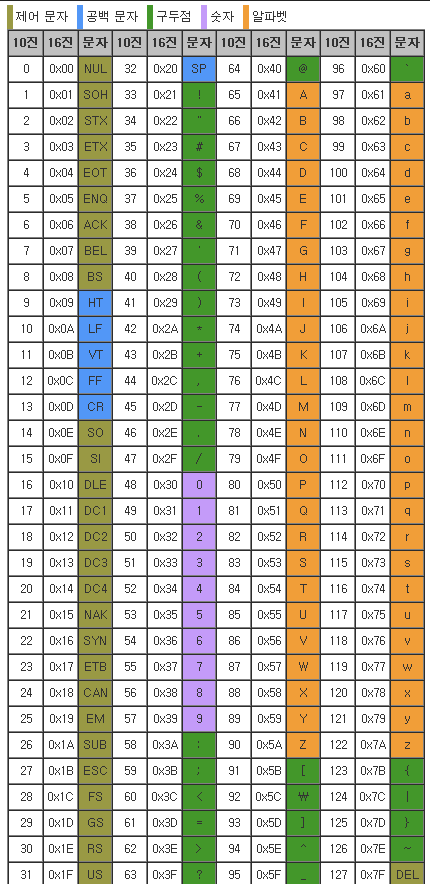

## ⭐ 문제 핵심
1. 가능한 총 경우의 수는 8개  
-> 가능한 경우의 수에 대해서 리스트로 만들고 좌표를 옮기면 되었던 문제!
2. 현재 행은 숫자, 열은 소문자 알파벳이다.  
-> 알파벳은 아스키코드로 변환시켜서 int로 숫자로 변형시켜서 코드를 구현하면 훨씬 더 편하게 코드를 구현할 수 있다는게 포인트였던 거 같다.   

## ⭐ 라이브러리 및 문법
- ord : 아스키 코드 반환    

## 아스키 코드

