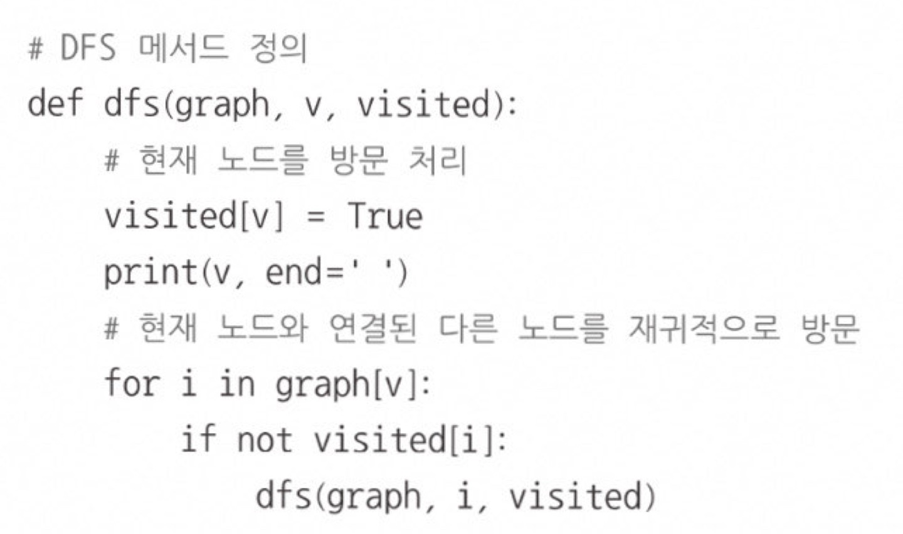
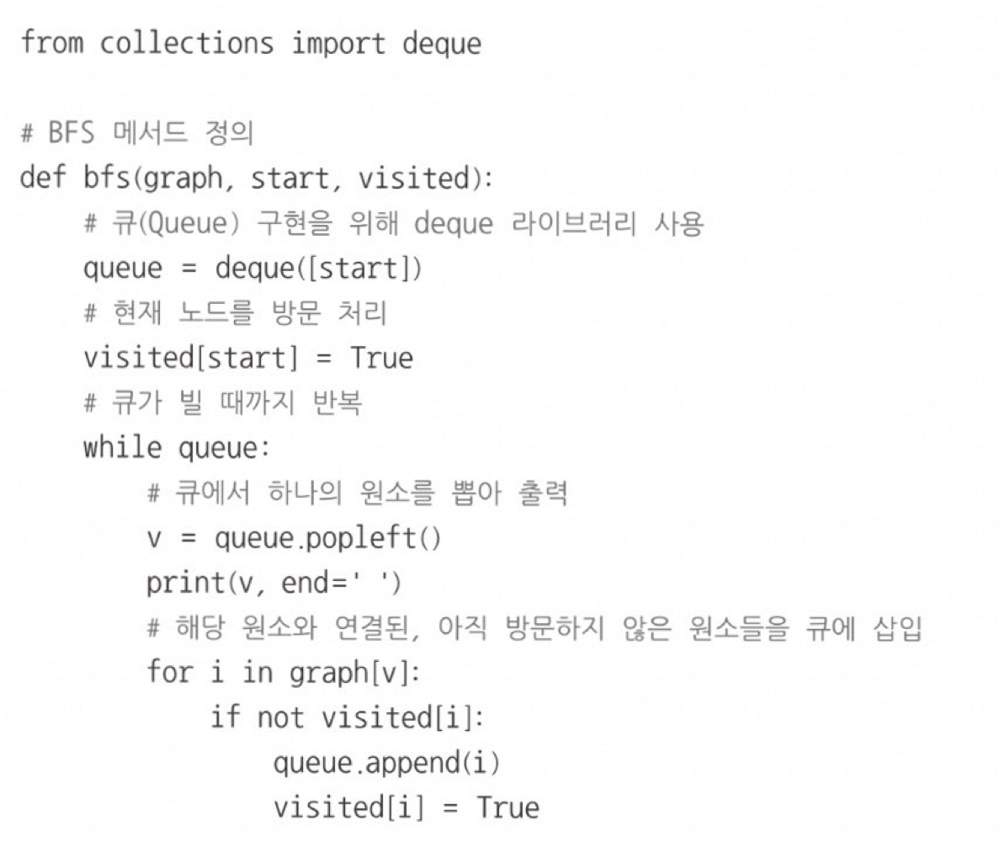
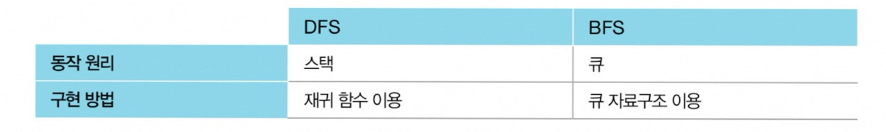

# 탐색 알고리즘
많은 양의 데이터 중에서 원하는 데이터를 찾는 과정   

# DFS (깊이 우선 탐색) 
## ⭐ STACK
그래프에서 깊은 부분을 우선적으로 탐색하는 알고리즘
- 인접 행렬 : 2차원 배열로 그래프의 연결 관계를 표현하는 방식  
&nbsp;&nbsp;&nbsp;&nbsp;&nbsp; / 연결되어 있지 않은 노드끼리는 무한의 비용이라고 작성 (INF)  
&nbsp;&nbsp;&nbsp;&nbsp;&nbsp; / 파이썬은 인접 행렬을 리스트로 구현한다.
- 인접 리스트 : 리스트로 그래프의 연결 관계를 표현하는 방식

📍 POINT)  
일반적으로 인접한 노드 중에서 방문하지 않은 노드가 여러개 있으면 번호가 낮은 순서부터 처리 

  

# BFS (너비 우선 탐색) 
 ## ⭐ QUEUE
 가까운 노드부터 탐색하는 알고리즘 

 POINT)  
 코테에서는 보통 DFS보다는 BFS 구현이 조금 더 빠르게 동작

  

# 자료구조 
데이터를 표현하고 관리하고 처리하기 위한 구조  
ex) 스택, 큐

 

## 스택(LIFO)
선입후출 구조 -> 먼저 들어온게 먼저 빠진다.  
[메소드 종류]  
- .append()
- .pop()

## 큐(FIFO)
선입선출 구조 -> 먼저 들어온게 가장 나중에 빠진다.  
[메소드 및 라이브러리 종류]  
- from collections import deque
- 주의) deque는 객체이기에 이걸 리스트로 변형하고자 한다면 list(deque) 사용
- .append()
- .popleft()

 

## 재귀함수
자기 자신을 다시 호출하는 함수  
주의) 재귀함수는 종료조건을 꼭 명시해야만 한다!
