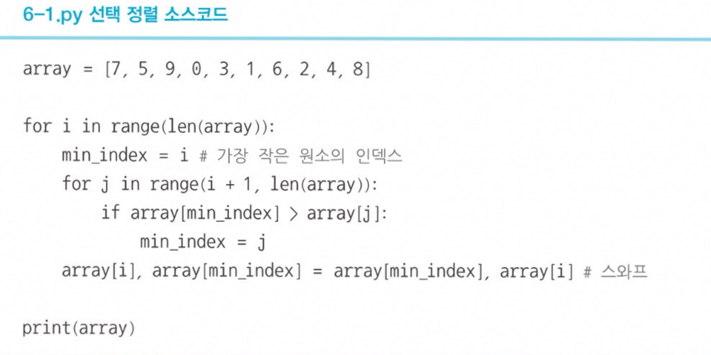
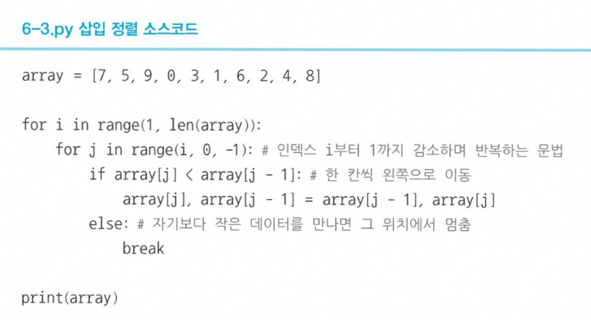
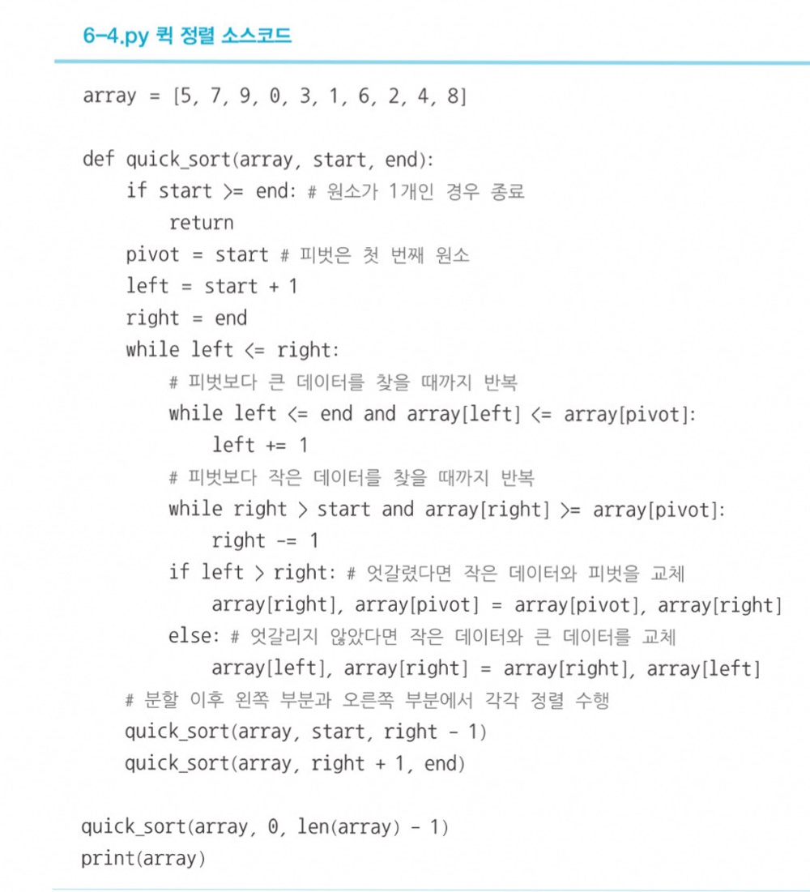
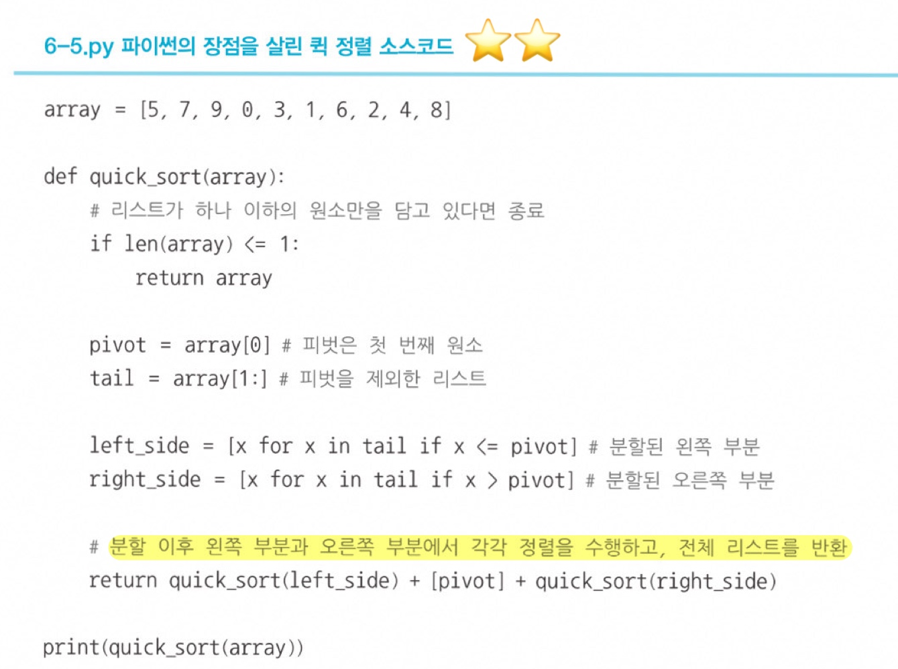
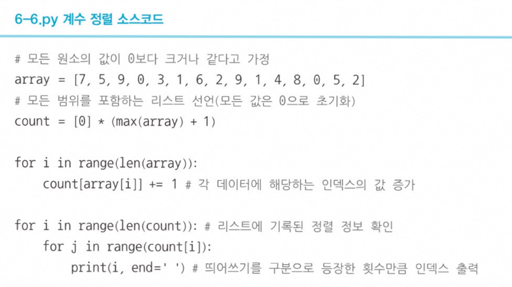
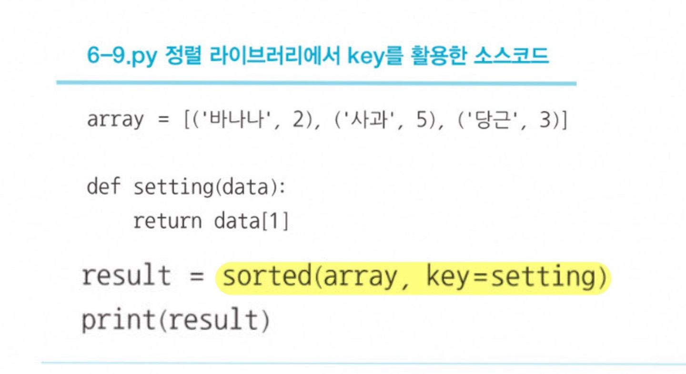
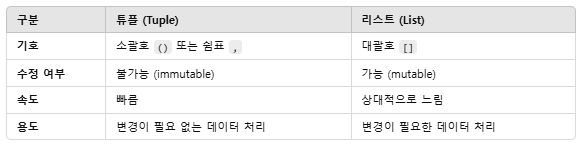

# 정렬 알고리즘
데이터를 특정한 기준에 따라서 순서대로 나열하는 것   

# 선택정렬 O(n^2)
### 📍 매번 가장 작은 것을 선택
데이터가 무작위로 있을 떄, 이 중에서 가장 작은 데이터를 선택해 맨 앞에 있는 데이터와 바꾸고, 그 다음 작은 데이터를 선택해 앞에서 두 번쨰 데이터와 바꾸는 과정을 반복   

  

# 삽입정렬 O(n^2)
### 📍 데이터를 하나씩 확인하며, 특정한 데이터를 적절한 위치에 삽입
- 삽입 정렬은 두 번째 데이터부터 시작한다. 왜냐면 첫 번째 데이터터는 그 자체로 정렬되어 있다고 판단하기 때문에   

  

# 퀵정렬 O(NlongN)
### 📍기준을 설정한 다음 큰 수와 작은 수를 교환한 후 리스트를 반으로 나누는 방식으로 동작
- 퀵정렬에서는 피벗이 사용된다.   
피벗이란?
- 큰 숫자와 작은 숫자를 교환할때, 교환하기 위한 '기준'을 바로 피벗이라고 표현
- 리스트에서 첫 번째 데이터를 피벗으로 정한다!
- 피벗을 설정한 뒤에는 왼쪽에서부터 피벗보다 큰 데이터를 찾고, 오른쪽에서부터 피벗보다 작은 데이터를 찾느다. 그 다음 큰 데이터와 작은 데이터의 위치를 서로 교환한다.   

  

# 계수정렬 O(N+K) -> 시간&공간 복잡도
### 📍특정한 조건이 부합할 때만 사용할 수 있지만 매우 빠른 정렬 알고리즘
- 계수정렬은 먼저 가장 큰 데이터와 가장 작은 데이터의 범위가 모두 담길 수 있도록 하나의 리스트를 생성한다.
- 처음에는 리스트의 모든 데이터가 0이 되도록 초기화한다.
- 데이터를 하나씩 확인하며 데이터의 값과 동일한 인덱스의 데이터를 1씩 증가시키면서 계수정렬이 완료된다. 
- 결과적으로 리스트에는 각 데이터가 몇 번 등장했는지 그 횟수가 기록된다.   

  

# 파이썬 정렬 라이브러리 O(NlongN)
1. sorted( ) : 반환되는 결과는 리스트 자료형
2. .sort( ) : 별도의 정렬된 리스트가 반환되지 않고 내부 원소가 바로 정렬
3. key를 이용한 소스코드 
    

  

# 파이썬 문법
- 튜플이란?  
파이썬의 기본 자료형 중 하나로, 여러 데이터를 하나의 묶음으로 저장할 수 있는 자료구조   
