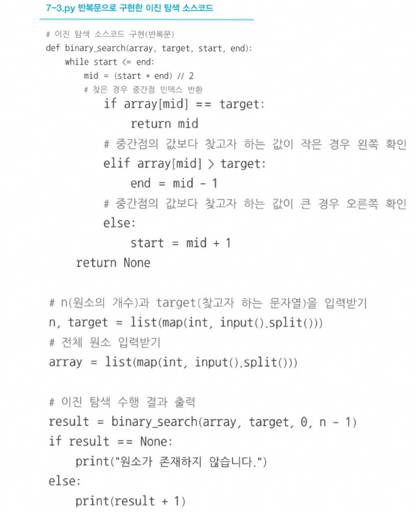

# 순차탐색 O(N)
**리스트 안**에 있는 특정한 데이터를 찾기 위해 앞에서부터 데이터를 차례대로 확인하는 방법   

# ⭐ 이진탐색 O(logN) 
### 📍 찾으려는 데이터와 중간점 위치에 있는 데이터를 반복적으로 비교  / 코드 암기!
- ⭐ **배열 내부의 데이터가 정렬되어 있어야만 사용할 수 있는 알고리즘** 
- 탐색 범위를 절반씩 좁혀가며 데이터를 탐색하는 특징이 존재
- 시작점, 중간점, 끝점이 존재 
- 중간점이 실수일 때는 소수점 이하를 버린다.   

  

# 트리 자료구조
## 트리 특징
- 트리는 부모 노드와 자식 노드의 관계로 표현된다.
- 트리의 최상단 노드를 루트 노드라고 한다.
- 트리의 최하단 노드를 단말 노드라고 한다.
- 트리에서 일부를 뗴어내도 트리 구조이며 이를 서브 트리라 한다.
- 트리는 파일 시스템과 같이 계층적이고 정렬된 데이터를 다루기에 적합하다.   

# 이진탐색 트리 O(logN) 
## 이진탐색 트리 특징
- 부모 노드보다 왼쪽 자식 노드가 작다.
- 부모 노드보다 오른쪽 자식 노드가 크다.
- **왼쪽 자식 노드 < 부모 노드 < 오른쪽 자식 노드**
