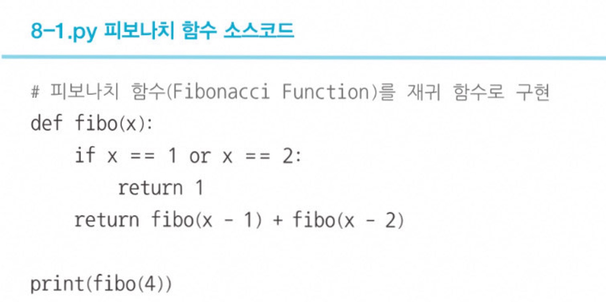
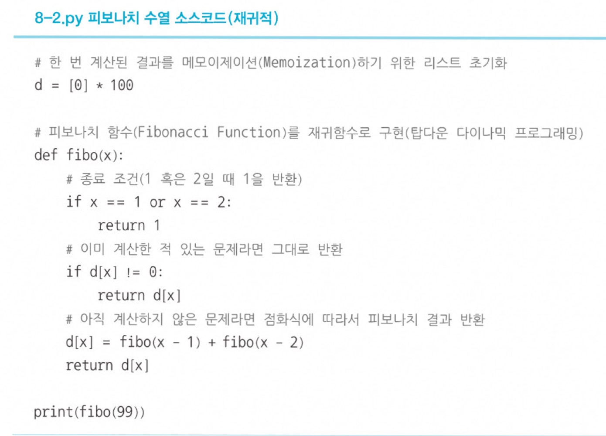

# 다이나믹 프로그래밍 = 동적 계획법
큰 문제를 작게 나누고, 같은 문제라면 한 번씩만 풀어 문제를 효율적으로 해결하는 알고리즘 기법   

## 📍 다이나믹 프로그래밍 사용 조건
1. 큰 문제를 작은 문제로 나눌 수 있다.
2. 작은 문제에서 구한 정답은 그것을 포함하는 큰 문제에서도 동일하다.  
-> 1&2를 만족해야 다이나믹 프로그래밍을 사용할 수 있다.

 

## 📍 메모제이션 기법이란?
한번 구한 결과를 메모리 공간에 메모해두고 같은 식을 다시 호출하면 메모한 결과를 그대로 가져오는 기법을 의미
- 메모제이션은 값을 저장하는 방법이므로 "**캐싱**"이라고도 한다.

   

# 피보나치 함수 O(N)
### 점화식 an = an-1 + an-2

   

## 📍 Top-Down 방식이란?
큰 문제를 해결하기 위해 작은 문제를 호출하는 방식   

## 📍 Bottom-Up 방식이란?
단순히 **반복문**을 이용하여 소스코드를 작성하는 경우 **작은 문제부터** 차근차근 답을 도출하는 방식