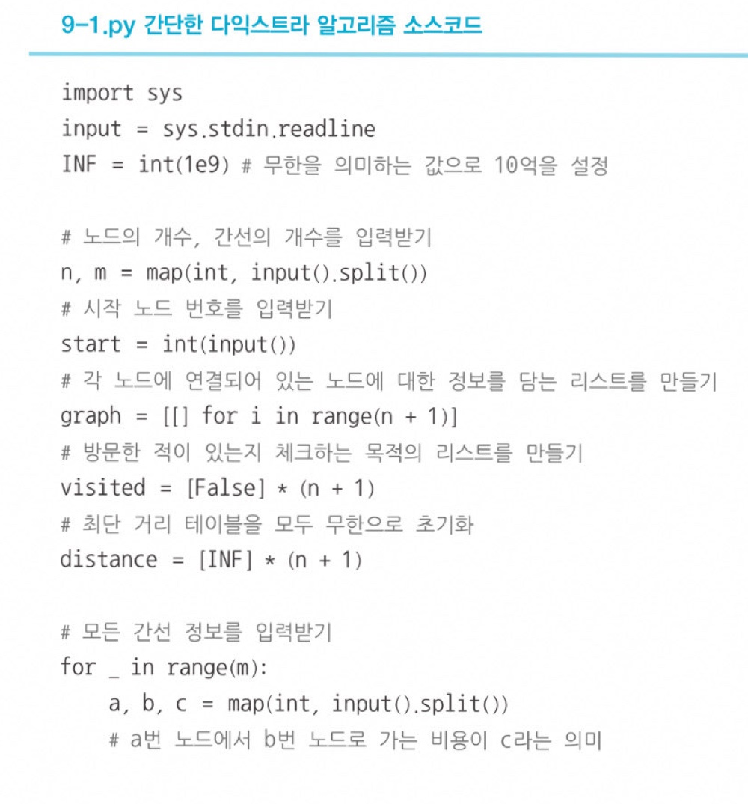
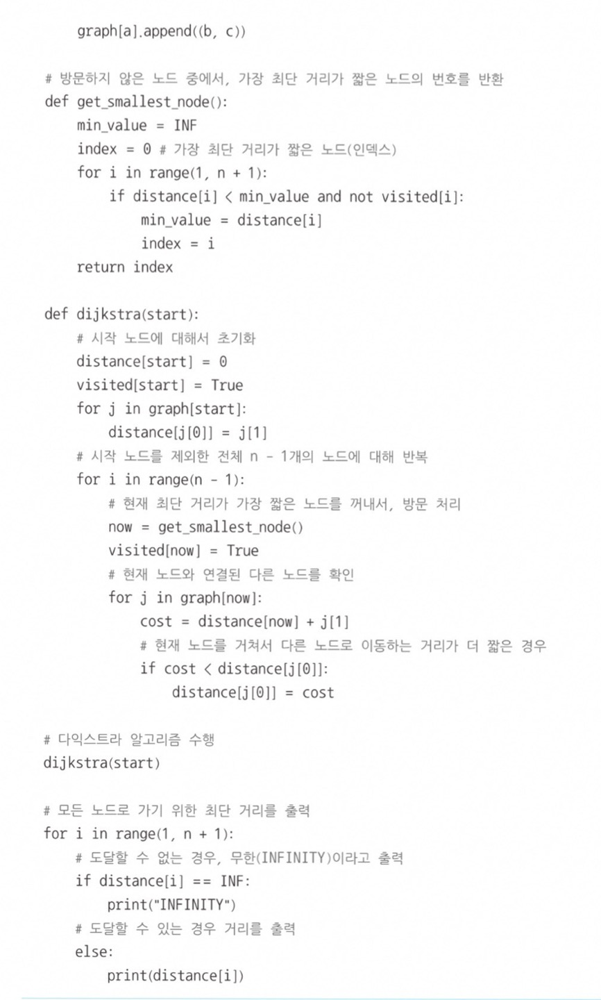
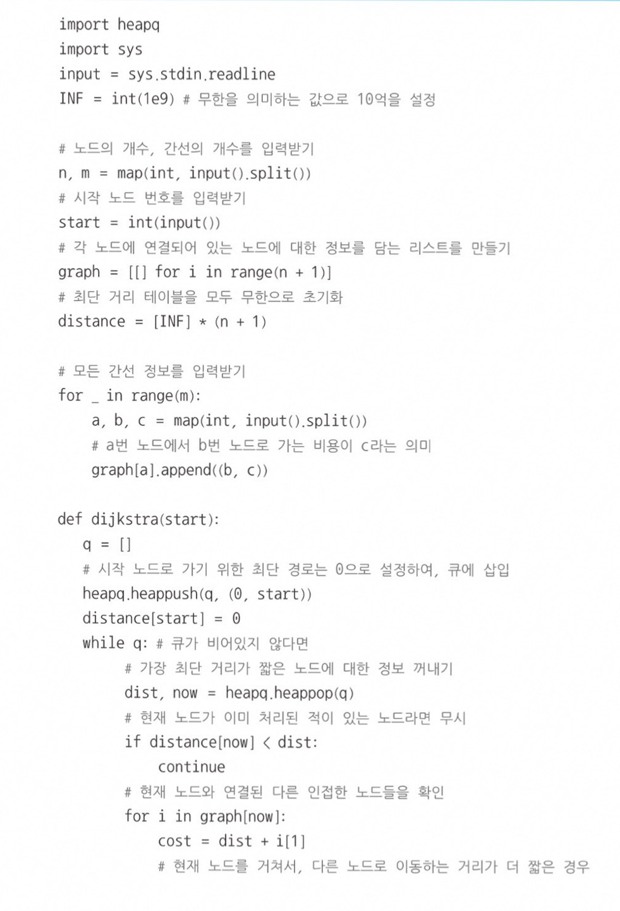
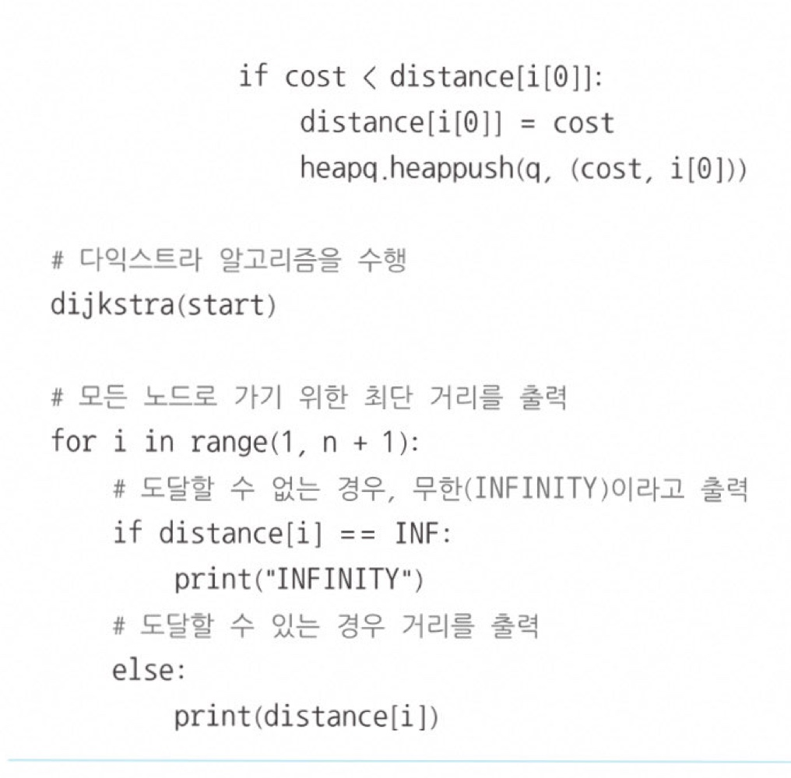
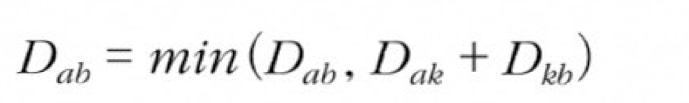
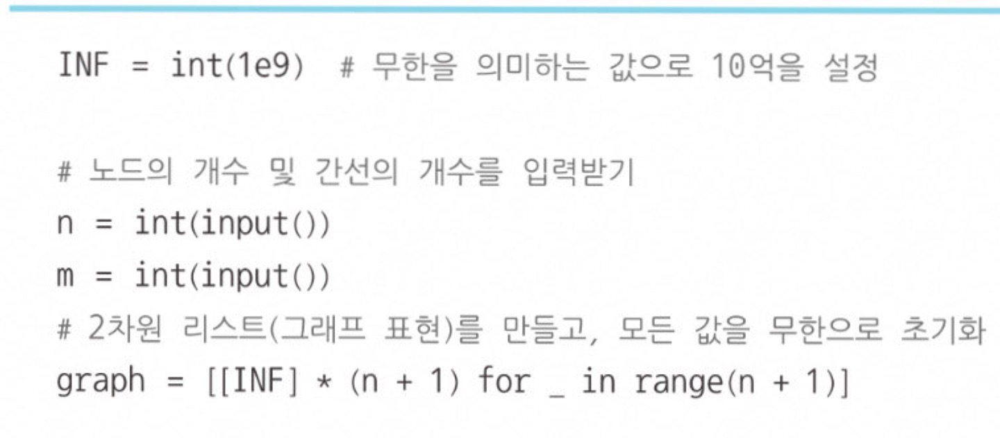
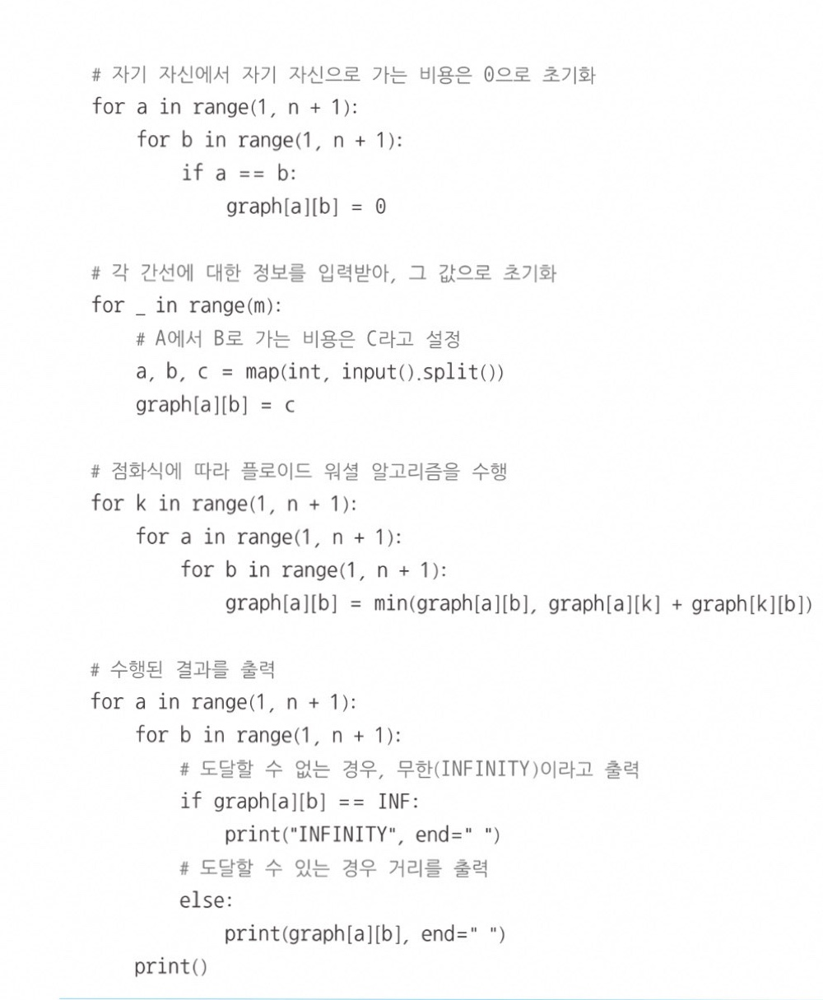
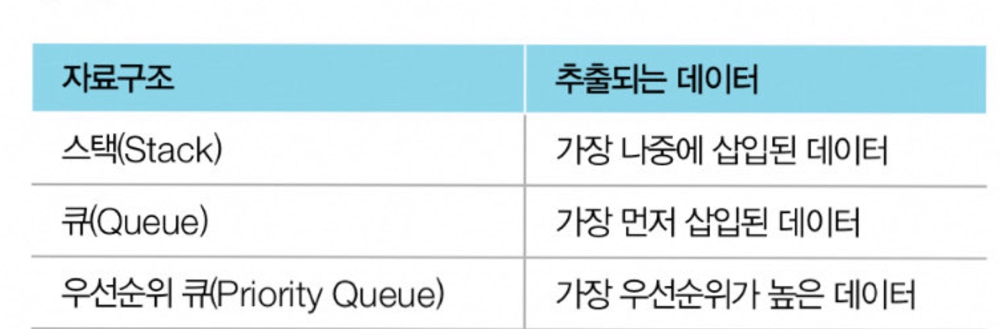
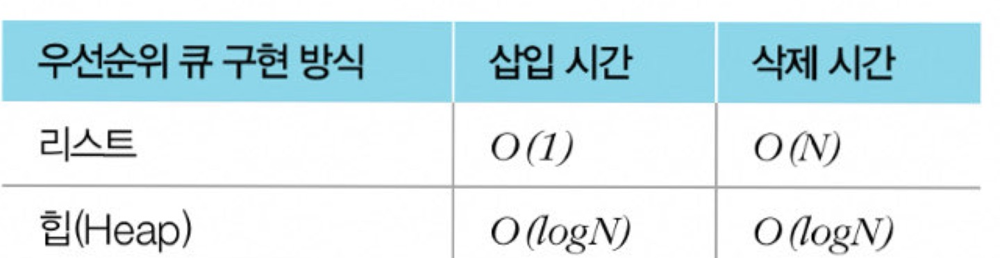

# 최단 경로
가장 짧은 경로를 찾는 알고리즘으로 보통 그래프를 이용해 표현   

## 최단 경로 알고리즘 종류
1. 다익스트라 최단 경로 알고리즘 ⭐
2. 플로이드 워셜 ⭐
3. 벨만 포드 알고리즘  
➕ 그리디 알고리즘  
➕ 다이나믹 프로그래밍 알고리즘
  

# 다익스트라 최단 경로 알고리즘
=  그리디 알고리즘으로 분류  
- 그래프에서 여러 개의 노드가 있을 떄, 특정한 노드에서 출발하여 다른 노드로 가는 **각각의 최단 경로를 구해주는 알고리즘**  
- " **음의 간선**"이 없을때 정상적으로 동작

## 알고리즘 간략 설명
1. 출발 노드를 설정
2. 최단 거리 테이블을 초기화
3. 방문하지 않은 노드 중에서 최단 거리가 가장 짧은 노드를 선택
4. 해당 노드를 거쳐 다른 노드로 가는 비용을 계산하여 최단 거리 거리 테이블을 갱신 -> 그리디 알고리즘
5. 위 과정에서 3번과 4번을 반복 

 매번 현재 처리하고 있는 노드를 기준으로 주변 간선을 확인   
⭐ 최단 거리가 같을 경우 번호가 작은 노드를 선택

## 방법1) 간단한 다익스트라 알고리즘
**시간 복잡도 O(V^2)** (단, V는 노드 개수)
- 단계마다 "방문하지 않은 노드 중에서 최단 거리가 가장 짧은 노드를 선택"하기 위해 매 단계마다 1차원 리스트의 모든 원소를 확인(순차 탐색)    

  

## 방법2) 개선된 다익스트라 알고리즘
**시간 복잡도 O(ElogV)** (단, E는 간선, V는 노드 개수)
- ⭐ **힙 자료구조를 사용**    

  

# 플로이드 워셜 알고리즘
= 다이나믹 프로그래밍
### 모든 지점에서 다른 모든 지점까지의 최단 경로를 모두 구해야 하는 경우
**시간 복잡도 O(N^3)**
- 2차원 리스트에 '최단 거리' 정보를 저장

- ⭐ A에서 B로 가는 최소 비용과 A에서 K를 거쳐 B로 가는 비용을 비교하여 더 작은 값으로 갱신하겠다는 것 즉, 바로 이동하는거리가 특정한 노드를 거쳐서 이동하는 거리보다 더 많은 비용을 가진다면 이를 더 짧은 것으로 갱산한다는 것  

  

## 📍힙 자료구조
- **우선 순위 큐**를 구현하기 위하여 사용하는 자료구조
- 큐는 가장 먼저 삽입된 데이터를 가장 먼저 삭제 -> **선입선출**
- 우선순위 큐는 우선순위가 가장 높은 데이터를 가장 먼저 삭제
- **PriorityQueue** 또는 **heapq** 사용
- ⭐ (가치, 물건) 일 경우 **'가치' 값**이 우선순위 값이 된다!

 

  

## 📍파이썬 무한 처리
### **int(1e9)**
1e9을 사용하면 10억임 파이썬에서 기본으로 1e9를 실수 자료형으로 처리하므로 모든 간선이 **정수형**으로 표현되는 문제에서는 int(1e9)로 초기화해서 무한으로 표기한다.